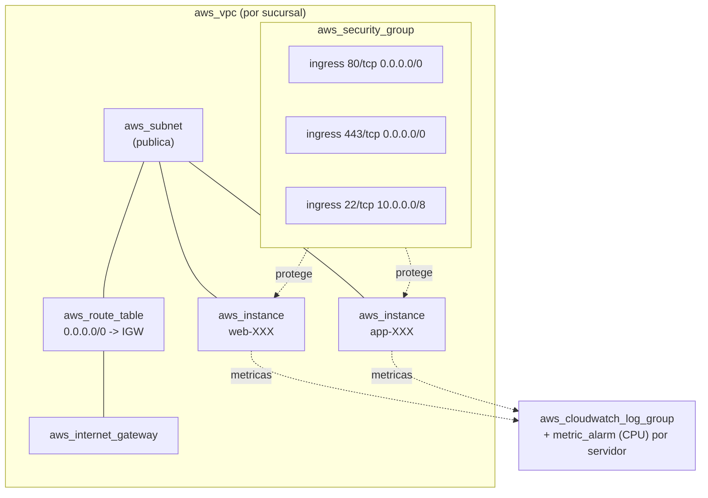

# Arquitectura AWS

## Recursos por sucursal

| Recurso | Cantidad | Modulo |
|---|---|---|
| `aws_vpc` | 1 | `aws/network` |
| `aws_subnet` | 1 | `aws/network` |
| `aws_internet_gateway` | 1 | `aws/network` |
| `aws_route_table` (+ association) | 1 | `aws/network` |
| `aws_security_group` | 1 | `aws/security` |
| `aws_security_group_rule` | N (segun `security_rules`) | `aws/security` |
| `aws_instance` | 2 | `aws/compute` |
| `aws_cloudwatch_log_group` | 1 | `aws/monitoring` |
| `aws_cloudwatch_metric_alarm` | 2 (una por servidor) | `aws/monitoring` |

Para las 25 sucursales AWS de esta demo: 25 VPC independientes, 50
instancias EC2, 25 Security Groups con 3 reglas cada uno (75 reglas) y 25
Log Groups con 50 alarmas de CPU.

## Justificacion de herramientas

| Herramienta | Por que |
|---|---|
| Terraform | Declarativo, multi-cloud, soporta `mock_provider` para pruebas sin credenciales (requisito del enunciado) |
| VPC por sucursal (no VPC compartida con subnets) | Aislamiento real de red por sucursal (RF-01); simplifica el blast radius de un cambio erroneo |
| Security Group por sucursal (no uno global) | Permite reglas especificas por sucursal sin afectar a las demas (RF-07) |
| CloudWatch | Servicio de monitoreo nativo de AWS, sin infraestructura adicional que administrar |
