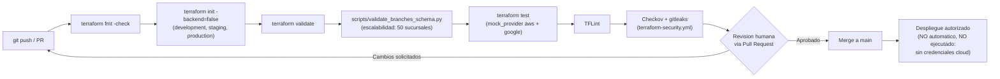

# Pipeline CI/CD

## Flujo comun AWS + GCP

Un unico flujo (`terraform-ci.yml`) valida AWS y GCP juntos porque ambos
proveedores conviven en el mismo `branch-stack` por entorno: no tiene
sentido separar el pipeline por proveedor cuando una sucursal puede estar en
cualquiera de los dos segun `branches.yaml`.

## Procedimiento de aprobacion

1. Rama de desarrollo (`feature/...` o `develop`).
2. Pull Request hacia `main` usando `.github/pull_request_template.md`.
3. Validaciones automaticas (`terraform-ci.yml`, `terraform-security.yml`)
   deben pasar en verde.
4. Revision humana obligatoria (checklist del PR template): al menos un
   revisor confirma que el `terraform plan` (con mocks) es el esperado y que
   no se intenta ningun `apply` real.
5. Aprobacion y merge.
6. "Despliegue autorizado": en este proyecto es un paso **documentado, no
   ejecutado** (ver seccion siguiente), porque no existen credenciales de
   AWS ni GCP.

## Por que el pipeline NUNCA ejecuta `terraform apply` contra AWS/GCP

Restriccion fundamental del enunciado: no se dispone de credenciales de
AWS ni GCP, y esta prohibido generar costos cloud o afirmar un despliegue
real que no ocurrio. Por eso:

- `terraform-ci.yml` usa siempre `-backend=false` y nunca configura
  `AWS_ACCESS_KEY_ID`/`GOOGLE_CREDENTIALS` como secretos de GitHub.
- La unica ejecucion de `terraform apply` en todo el pipeline ocurre en
  `drift-check.yml`, y es contra el provider `local` (`lab/drift`), nunca
  contra AWS/GCP.
- El job `real-cloud-drift-check-disabled` en `drift-check.yml` queda
  explicitamente deshabilitado (`if: false`) como marcador documentado de
  donde se conectaria la deteccion real, sin simular que ya existe.

## Habilitar el despliegue real en el futuro

Para pasar de esta demo a un despliegue real, sin cambiar los modulos
Terraform:

1. Configurar backends remotos (`docs/architecture/terraform-state-strategy.md`).
2. Configurar autenticacion sin claves estaticas: GitHub OIDC hacia un rol de
   IAM en AWS (`aws-actions/configure-aws-credentials` con
   `role-to-assume`) y Workload Identity Federation hacia una cuenta de
   servicio en GCP (`google-github-actions/auth`). Ninguna clave de acceso
   de larga duracion se guarda como secreto de GitHub.
3. Agregar un job `terraform plan` (contra el backend remoto real) que se
   publique como comentario del PR para revision humana.
4. Agregar un job `terraform apply`, protegido por un **GitHub Environment**
   con "required reviewers", ejecutado solo tras aprobacion manual en la
   interfaz de GitHub (no automatico en el merge).
5. Retirar `if: false` del job de deteccion real de drift y apuntarlo al
   backend remoto.
