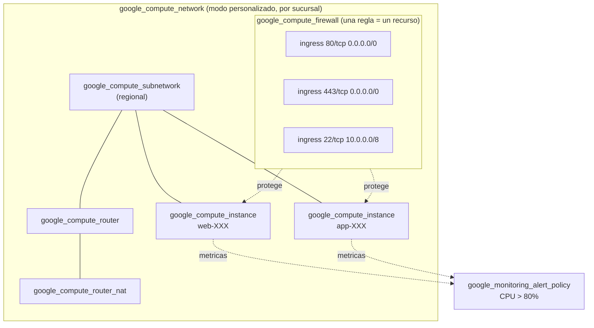

# Arquitectura GCP

## Recursos por sucursal

| Recurso | Cantidad | Modulo |
|---|---|---|
| `google_compute_network` | 1 | `gcp/network` |
| `google_compute_subnetwork` | 1 | `gcp/network` |
| `google_compute_router` + `google_compute_router_nat` | 1 + 1 | `gcp/network` |
| `google_compute_firewall` | N (una por regla declarada) | `gcp/security` |
| `google_compute_instance` | 2 | `gcp/compute` |
| `google_monitoring_alert_policy` | 1 | `gcp/monitoring` |

Para las 25 sucursales GCP de esta demo: 25 VPC Networks, 50 instancias de
Compute Engine, 75 reglas de firewall y 25 politicas de alerta de CPU.

## Diferencias tecnicas respecto a AWS (documentadas, no forzadas a una abstraccion comun)

| Aspecto | AWS | GCP |
|---|---|---|
| Contenedor de reglas de seguridad | Security Group (1 recurso con N reglas anidadas) | Sin contenedor: cada regla es un `google_compute_firewall` independiente asociado a la red |
| Salida a Internet | Internet Gateway + ruta 0.0.0.0/0 | Cloud NAT (las instancias sin IP publica salen via NAT; en esta demo se usa `access_config` con IP efimera para simplificar, documentado en `modules/gcp/compute`) |
| Alcance de la region | A nivel de **provider** (una region por configuracion de provider) | A nivel de **recurso** (`region`/`zone` como argumento), permite combinar regiones con un unico provider |
| Retencion de logs | Por recurso (`aws_cloudwatch_log_group.retention_in_days`) | Por proyecto (`google_logging_project_bucket_config`), fuera del alcance de un modulo por sucursal (ver `modules/gcp/monitoring/README.md`) |

## Justificacion de herramientas

| Herramienta | Por que |
|---|---|
| VPC en modo personalizado (`auto_create_subnetworks = false`) | Evita que GCP cree subnets automaticas en todas las regiones; cada sucursal declara exactamente la subnet que necesita |
| Cloud Router + Cloud NAT | Patron recomendado por GCP para dar salida a Internet a instancias sin IP publica fija, sin exponer SSH directamente |
| Cloud Monitoring (`google_monitoring_alert_policy`) | Servicio nativo de GCP, sin infraestructura adicional que administrar |
