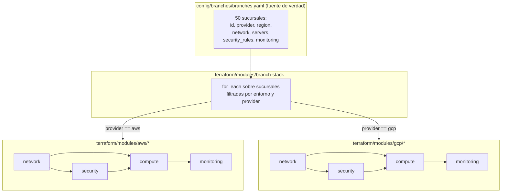

# Arquitectura general — IaC para 50 sucursales multi-cloud

## 1. Patron de diseno

Cada sucursal es una instancia de un **patron comun** descrito como datos
(`config/branches/branches.yaml`), no como codigo repetido. El patron exige,
por sucursal:

1. Una red independiente (VPC/VPC Network + subnet dedicada).
2. Dos servidores (`web`, `app`).
3. Reglas de seguridad (Security Group en AWS / Firewall Rules en GCP).
4. Monitoreo (CloudWatch en AWS / Cloud Monitoring en GCP).

## 2. Interfaz comun entre proveedores

Para que agregar una sucursal sea un cambio de **datos** y no de **codigo**,
los 8 modulos base comparten la misma forma de entrada logica aunque cada
proveedor exponga argumentos distintos:

| Concepto logico (comun) | AWS (`modules/aws/*`)            | GCP (`modules/gcp/*`)                 |
|---------------------------|-----------------------------------|-----------------------------------------|
| Red de la sucursal         | `aws_vpc` + `aws_subnet`          | `google_compute_network` + `google_compute_subnetwork` |
| Tamano de servidor (`size`) | `instance_type` (t3.micro/small/medium) | `machine_type` (e2-micro/small/medium) |
| Servidor                   | `aws_instance`                    | `google_compute_instance`              |
| Regla de seguridad          | `aws_security_group_rule`         | `google_compute_firewall` (1 recurso por regla) |
| Monitoreo                  | `aws_cloudwatch_log_group` + `aws_cloudwatch_metric_alarm` | `google_monitoring_alert_policy` |

Las diferencias tecnicas reales (GCP no tiene un objeto "Security Group"
contenedor; AWS fija la region a nivel de provider y GCP a nivel de recurso;
GCP gestiona la retencion de logs a nivel de proyecto) se documentan en el
README de cada modulo y se respetan explicitamente en vez de forzar una
abstraccion artificial.

## 3. Extensibilidad (RNF)

Agregar la sucursal 51 es agregar una entrada a `branches.yaml` (o
regenerar el archivo con `scripts/generate_branches.py` ajustando los
parametros). Ningun archivo `.tf` cambia. Esto se verifica automaticamente
en `terraform/tests/branch_stack.tftest.hcl` y en
`scripts/validate_branches_schema.py`.

## 4. Supuesto academico de distribucion AWS/GCP

El enunciado exige distribuir las 50 sucursales entre AWS y GCP "para la
demostracion" y pide indicar explicitamente que es un supuesto academico.
Esta demo usa una distribucion **25 AWS / 25 GCP** (sucursales con id impar
-> AWS, id par -> GCP), ver `scripts/generate_branches.py`. En un caso real
la asignacion dependeria de criterios de negocio ajenos a este laboratorio
(contratos marco, presencia regional de cada proveedor, costos negociados,
latencia a los puntos de venta, etc.).

## 5. Entornos y estado

| Entorno      | Sucursales (de las 50) | Proposito |
|--------------|--------------------------|-----------|
| `production`  | 40 (ids 001-040)          | Sucursales operativas |
| `staging`      | 6 (ids 041-046)           | Validacion previa a produccion |
| `development`  | 4 (ids 047-050)           | Pruebas de nuevas sucursales/modulos |

Cada entorno tiene su propio estado de Terraform (aislamiento de blast
radius): ver `docs/architecture/terraform-state-strategy.md`.

## 6. Limitacion de diseno documentada: regiones AWS

Todas las sucursales AWS de esta demo comparten una unica region
(`sa-east-1`) porque el provider `aws` de Terraform fija la region a nivel
de **provider**, no de recurso. Soportar varias regiones AWS en el mismo
`apply` exige alias de provider (`aws.sa_east_1`, `aws.us_east_1`, ...)
pasados explicitamente a cada modulo — una extension valida pero fuera del
alcance de este laboratorio academico sin credenciales. GCP si combina
varias regiones con un unico provider porque `region`/`zone` son argumentos
de **recurso** (ver `modules/gcp/network` y `modules/gcp/compute`).
